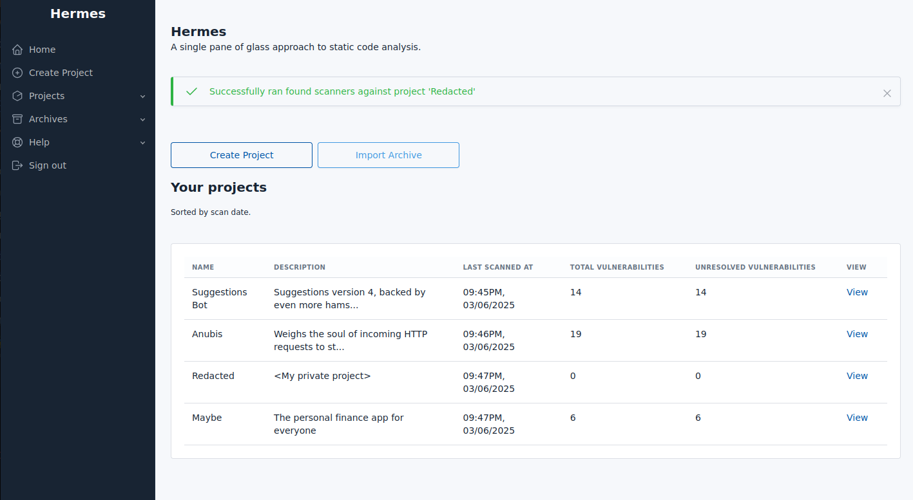
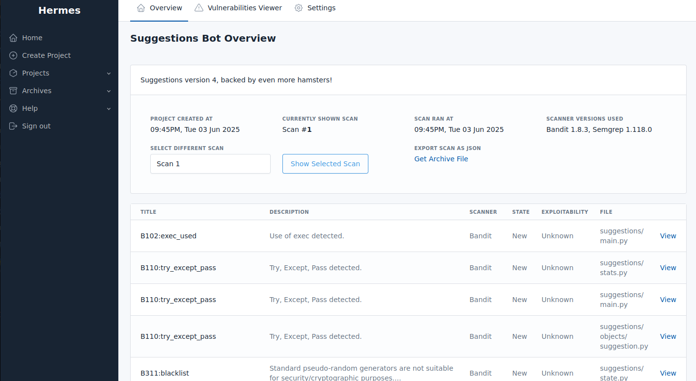

# Hermes

A single pane of glass for static code analysis

---

It's the perfect addition to any bug bounty hunters toolkit. This tool takes in __any__ output from a Static Application Security Testing (SAST) scanner and makes it pretty while adding functionality such as easy triaging and vulnerability related note-taking.

By default, the following scanners / languages are supported:
- [Bandit](https://github.com/PyCQA/bandit) - Python
- [Brakeman](https://brakemanscanner.org/) - Ruby
- [GoSec](https://github.com/securego/gosec) - Go
- [Semgrep](https://semgrep.dev/) - Multiple Languages

#### Features

- Native Role Based Access Control (RBAC) so you can collaborate on projects with friends.
- Native archiving support for when you need to export projects to store alongside other notes for later retrival and review.
- Status fields per vulnerability for tracking vulnerability investigation progress.
- Notes fields on every single vulnerability to ensure context remains tied to a given vulnerability.
- Support for uploading Zip files, for those non git managed projects.
- Support for Git repositories, as well as the ability to re-pull new versions at any stage.
- Integration with any SAST tooling through analysis interfaces. See `home/analysis/` for current implementations that can be copied.
- Access to the raw SAST scanner output within each vulnerability for when more details are required.
- A full featured admin panel providing raw access to data as required.
- Open source so you can open issues and pull requests to your hearts content.
- Background processing for large tasks. Fire off scans at will and come back later once they have actually finished without impact site performance.

#### Example application images

Home page:

Project overview page:

An example vulnerability page:

An example screenshot focusing on the vulnerability details and notes section:
